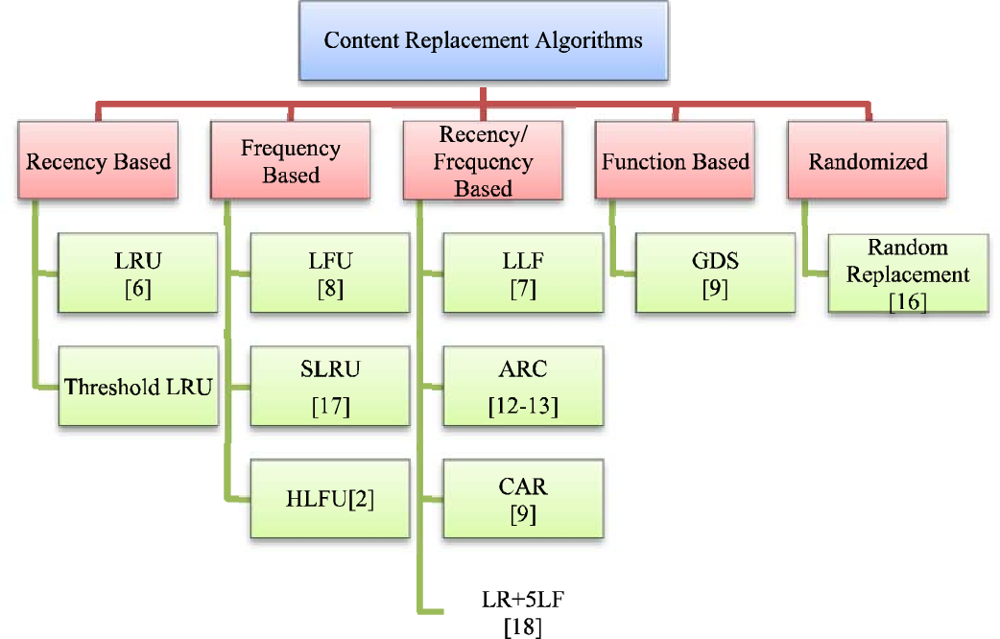

# Cache Replacement Policy

A cache replacement policy is a critical component of caching systems that determines which items are evicted from the cache when it becomes full. Different replacement policies have their own advantages and disadvantages, making them suitable for specific use cases. This README provides an overview of four common cache replacement policies: FIFO, LRU, CLOCK, and LFU. Additionally, it presents implementations of these policies in the Go programming language, along with discussions on their pros and cons.

## Replacement Policies

### 1. FIFO (First-In-First-Out)
FIFO is a straightforward replacement policy where the first item added to the cache is the first to be evicted when the cache is full. It's based on the principle that the oldest item is the least likely to be used in the near future.

#### Pros:
- Simple implementation.
- Guarantees fairness as items are evicted in the order they were added.

#### Cons:
- Doesn't take actual usage patterns into account.
- Doesn't perform well when there's a mix of frequently and rarely used items.

### 2. LRU (Least Recently Used)
LRU replaces the least recently used item when the cache is full. It assumes that items that haven't been accessed for a long time are less likely to be needed soon.

#### Pros:
- Takes usage patterns into account.
- Performs well for scenarios where temporal locality matters.

#### Cons:
- More complex to implement compared to FIFO.
- May require additional data structures (e.g., a doubly linked list) for efficient implementation.

### 3. CLOCK (Approximated LRU)
CLOCK is a simplified version of LRU that uses a circular buffer and a "clock hand" pointer to approximate which item to evict next. When an item is accessed, its clock bit is set. When eviction is needed, the algorithm evicts the first item with a cleared clock bit, making it a reasonable approximation of LRU.

#### Pros:
- Simpler to implement than LRU.
- Requires less memory overhead compared to maintaining a full linked list.

#### Cons:
- Not as accurate as LRU in modeling actual usage patterns.
- May not perform optimally for all scenarios.

### 4. LFU (Least Frequently Used)
LFU evicts the item that has been accessed the least number of times when the cache is full. It's based on the idea that items that are used less frequently are less valuable to keep in the cache.

#### Pros:
- Takes frequency of usage into account.
- Can perform well for workloads with varying access patterns.

#### Cons:
- Requires tracking the usage count of each item, which can be memory-intensive.
- May not handle sudden changes in access patterns effectively.

## Contributing
Contributions are what make the open source community such an amazing place to be learn, inspire, and create. Any contributions you make are **greatly appreciated**.

Before contributing, please read the [code of conduct](CODE_OF_CONDUCT.md) & [contributing guidelines](CONTRIBUTING.md).

## Support
A simple star to this project repo is enough to keep me motivated on this project for days. If you find your self very much excited with this project let me know with a tweet.
## License
Distributed under the MIT License. See [LICENSE](LICENSE) for more information.